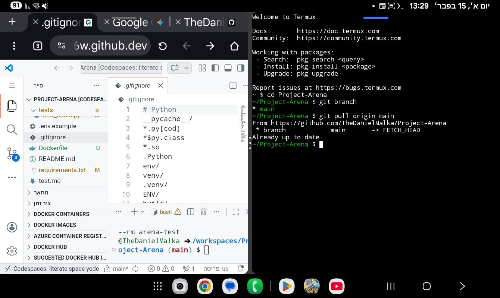

# 🚀 DevOps Roadmap - Zero to Production Engineer

Welcome to my unique DevOps journey. Unlike traditional learning, this repository documents a **"Build While You Learn"** methodology. I am building a complete, enterprise-grade DevOps ecosystem from scratch, implementing every concept as I master it.

## 🧠 The Concept: Learning by Engineering
I treat my learning process as a professional project. This repository isn't just for code; it's a live demonstration of infrastructure setup, task management, and automation.
* **From 0 to Hero:** Every tool is configured manually to understand the "under the hood" mechanics.
* **Agile Learning:** Managed via Jira with full GitHub integration.
* **Professional Standards:** Implementing CI/CD, Linting, and Testing from day one.

## 🛠 Management & Engineering Standards
I manage this roadmap like a production-grade R&D project. Just like configuring an **SSH Key**, there is no room for "almost." Every task is documented and verified to ensure 100% operational readiness.

<table width="100%">
  <tr>
    <td width="50%" align="center">
      <b>Agile Project Management (Jira)</b> 
      
    </td>
    <td width="50%" align="center">
      <b>Git Methodology (Issues & Labels)</b> 
      
    </td>
  </tr>
</table>

## 🛠 Tech Stack & Ecosystem Integration
* **Project Management:** [Jira](https://the-daniel-malka.atlassian.net/jira) (Scrum methodology)
* **CI/CD Pipeline:** GitHub Actions (Automated Test & Lint)
* **Environment & Config:** NPM & Python
* **Source Control:** Git (Trunk-based workflow)
* Termux when pc dosent work u make something else work

 <table width="100%">
  <tr>
    <td width="50%" align="center">
      <b>Git Methodology (Issues & Labels)</b> 
      
    </td>
  </tr>
</table>

## 📈 Progress Tracking
I maintain full transparency of my growth:
* **[Daily Progression Log](./Progression.txt):** What I implemented today.
* **[LinkedIn](https://www.linkedin.com/in/daniel-malkaa/)**

---
*Developed by Daniel Malka - Focused on mastering DevOps through hands-on infrastructure engineering.*
